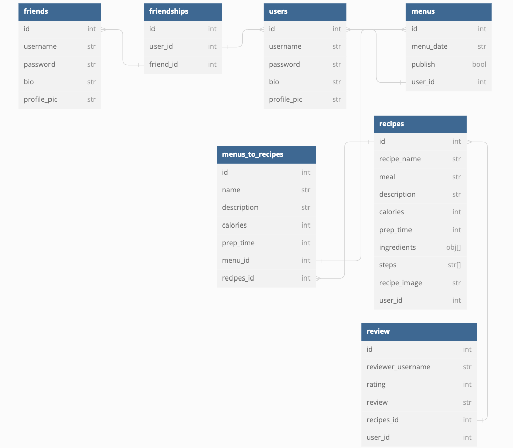

# phase-5-project-head-chef

## Description


**LINK:** https://github.com/ChristopherAPerez/phase-5-project-head-chef

**LIVE LINK:** 

### Model:



## Requirements

- Ruby 2.7.4
- NodeJS (v16), and npm
- Twilio account

## Environment Setup

### Install the Latest Ruby Version

Verify which version of Ruby you're running by entering this in the terminal:

```console
$ ruby -v
```

We recommend version 2.7.4. If you need to upgrade you can install it using rvm:

```console
$ rvm install 2.7.4 --default
```

You should also install the latest versions of `bundler` and `rails`:

```console
$ gem install bundler
$ gem install rails
```

### Install NodeJS

Verify you are running a recent version of Node with:

```sh
node -v
```

If your Node version is not 16.x.x, install it and set it as the current and
default version with:

```sh
nvm install 16
nvm use 16
nvm alias default 16
```

You can also update your npm version with:

```sh
npm i -g npm
```

## Setup

Start by **cloning** the project:
the remote:

```console
$ git clone git@github.com:ChristopherAPerez/phase-5-project-head-chef.git
```

Then, `cd` phase-5-project-head-chef:

```console
$ cd phase-5-project-head-chef
```

Once inside the file, you may run:

```console
$ bundle install
```

This will allow all the necessary gemfiles to install. You may also see the gems by entering:

```console
$ gem list
```

Next:

```console
$ rails db:create
```

Next, focus on the frontend needs:

```console
$ npm install --prefix client
```

After, run the migrations and use the provided seeds.rb file to `seed` the database. This will provide data for the application.

```console
$ rails db:migrate db:seed
```

```console
$ rails db:seed
```

Finally, you can start your server with with `rails s server` in a seperate terminal.

```console
$ rails s
```

After, start the react-app, also in a seperate terminal:

```console
$ npm start --prefix client
```

And you've set up the frontend and backend for the appilcation!

### Set Up a Twilio Account

You can sign up for a free account at [https://www.twilio.com/try-twilio][twilio signup].

[twilio signup]: https://www.twilio.com/try-twilio

Once you've completed the signup process, you will be taken to your Twilio Account info, where you will have access to your personal Account SID, Auth Token, and Twilio phone number. Be sure you verify the number you wish to use for Head-Chef.

## Resources

- [create-react-app][]
- [dbdiagram.io][]
- [Postman][postman download]
- [react-modal][]
- [react-chartjs-2][]
- [twilio][]

[create-react-app]: https://create-react-app.dev/docs/getting-started
[create repo]: https://docs.github.com/en/get-started/quickstart/create-a-repo
[dbdiagram.io]: https://dbdiagram.io/
[postman download]: https://www.postman.com/downloads/
[react-modal]: https://www.npmjs.com/package/react-modal
[react-chartjs-2]: https://react-chartjs-2.js.org/
[twilio]: https://www.twilio.com/try-twilio